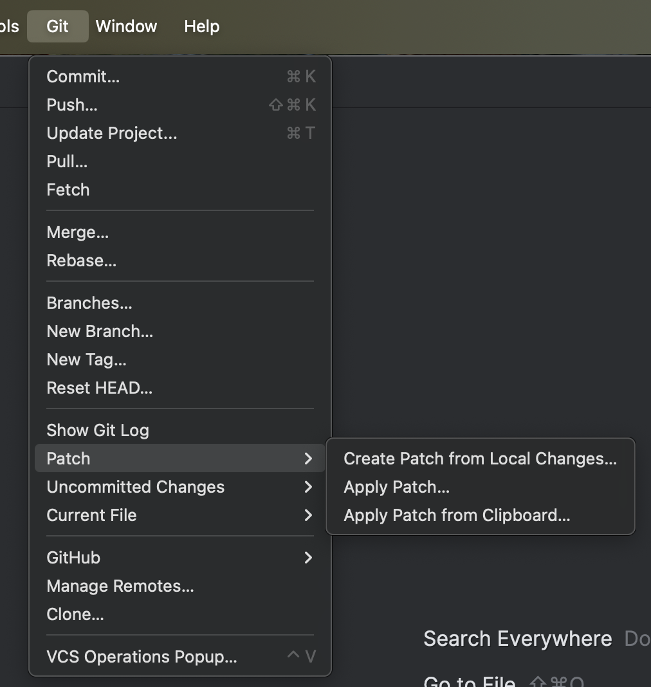

# Commit Porting Scripts for C7 to Operaton Repository

This repository contains scripts to assist in porting commits from the `camunda-bpm-platform` repository to the `operaton` repository. The scripts automate cloning the repositories, creating patches, rewriting terms, and applying the patches.

You can track the status of ported commits in this [online spreadsheet](https://docs.google.com/spreadsheets/d/1hARQXf8TSSO5UeaibwTRUQ0uOkAO6oLv759IE42d668/edit?gid=0#gid=0).

---

### init-git.sh

This script clones the `camunda-bpm-platform` and `operaton` repositories into the current directory.

#### Usage

```bash
./init-git.sh
```

#### Setting Up a Remote Named fork

If you want to automatically push the backported branch to a remote, add a remote named fork. Replace <url-to-your-fork> with the URL of your forked repository.

```bash
cd operaton
git remote add fork <url-to-your-fork>
```

For example

```bash
cd operaton
git remote add fork https://github.com/hauptmedia/operaton.git
```


### rewrite-commit.sh

This script automates the process of porting a specific commit from the camunda-bpm-platform repository to the operaton repository. It takes a commit SHA as an argument, generates a patch from it, rewrites specific terms (e.g., changes camunda to operaton), and applies the modified patch in the operaton repository with the original commit message.

#### Usage

```bash
./rewrite-commit.sh <commit-sha>
```

For example


```bash
# Port commit abc1234 from camunda-bpm-platform to operaton

./rewrite-commit.sh abc1234
```

### Manually Applying a Patch in IntelliJ

If you encounter conflicts while applying a patch, the script generates a patch file 
that you can use with IntelliJ’s built-in **Apply Patch** feature. 

Follow these steps:

1. **Open the Git Menu**:
    - In IntelliJ, navigate to the top menu bar and select **Git**.

   

2. **Select the Patch Option**:
    - Hover over **Patch** in the dropdown menu. You’ll see additional options appear to the right.

3. **Choose Apply Patch**:
    - Click on **Apply Patch…** to open a file dialog.
    - Locate and select the patch file that the script shows you as "Patch file".

4. **Resolve Conflicts**:
    - IntelliJ will attempt to apply the patch automatically. It will open a conflict resolution interface, allowing you to manually resolve issues.
    - Review each conflicting file and decide whether to keep changes from the patch, the existing code, or merge them manually.

5. **Review Changes and Commit**:
    - Once the patch is applied, review the changes to ensure they were applied correctly.
    - Use the **Commit** option in IntelliJ to commit the changes and copy and paste the commit message that was generated by the script.
